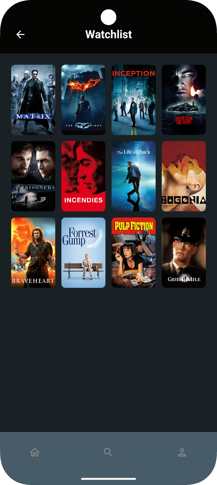

# 🎬 Movieboxxd – Android App

**Movieboxxd** is an Android application for movie enthusiasts, supporting rich discovery, rating, and management of favorite films.
Developed using the official TMDB API, it features seamless browsing, personal lists, and real-time updates.

---

## 📸 Screenshots

  
  
  
  

    
    
    

    
    
    

---

## ✨ Features
- **🔐 Login via TMDB API** – Authenticate securely with your TMDB account
- **🏠 Home Screen** – Trending and discover movies
- **🔎 Search Screen** – Fast search for movies
- **👤 Profile Screen** – Unified view of your Favorites, Rated Movies, and Watchlist
- **⭐ Movie Detail Page** – See every detail about a movie, cast, recommendations, ratings, and more
- **⭐ Rate, Favorite, Watchlist** – Instantly rate movies, mark as favorite, or add/remove from watchlist
- **❌ Delete Actions** – Remove ratings, favorites, or watchlist items at any time
- **⚡ Real-Time Sync** – All actions update instantly via TMDB API
- **🎨 Modern UI** – Built 100% in Jetpack Compose for a smooth experience

---

## 🛠️ Tech Stack

- **Kotlin** – Primary language
- **Jetpack Compose** – Modern, declarative UI toolkit
- **Navigation 2.0 (Compose)** – Seamless in-app navigation
- **Coroutines & StateFlow** – Reactive, lifecycle-aware state management
- **Retrofit** – Type-safe HTTP client for TMDB API integration
- **Dagger Hilt** – Dependency injection for scalable architecture
- **DataStore** – Secure and efficient data persistence

---

## ⚙️ Architecture
- **MVVM Pattern** – Domain logic in ViewModels, repository pattern for data sources, and composables for UI
- **Domain/Data Layer Separation** – All TMDB models, networking, repositories kept isolated from UI layer
- **Reactive UI** – StateFlow streams drive UI, all screens remain up-to-date automatically
- **DI with Dagger Hilt** – Simplifies injection of ViewModels, repositories, and network services
- **Persistence** – Datastore used for local user/session storage (tokens, preferences)
- **TMDB API** – All movie, account, and list interactions via the official API

---

## 🖥️ Main Screens & Workflow
- **Home Screen** - See trending and discover movies
- **More Movies Screen** - Browse more movies
- **Search Screen** - Instantly find movies
- **Profile Screen** - Profile information, favorites, watchlist, and rated movies
- **Movie Detail Screen** - Discover cast, summary, trailers, and interact (rate, favorite, watchlist)

---

## 💡 User Actions
- **Login** - Authenticates with TMDB, stores secure session via Datastore
- **Rate** - Assign and update ratings on any movie
- **Favorite/Unfavorite** - Toggle favorite status
- **Add/Remove Watchlist** - Organize your to-watch queue
- **Delete** Remove ratings, favorites, and watchlist entries any time

---

## 🚀 Quick Start
- Clone the repository
- Set your TMDB API key in the project
- Run the app in Android Studio
- Log in with your TMDB account and start exploring!